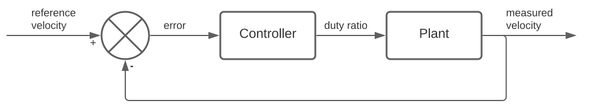

# Simple PID controller


A PID controller with output saturation is implemented in python for a DC motor control application.


### Implementation

The PID controller was implemented as a class named [**SimplePIDController**](controller.py)

```python
class PIDControler(kp, ki, kd, lim_min, lim_max, T):
```

**Class attributes and methods:**

```python
kp: float  # proportional gain
ki: float  # integral gain
kd: float  # derivative gain
lim_min: float  # min value for output saturation
lim_max: float  # max value for output saturation    
T: float  # sample time
    
i: float = 0  # controller memory - integral term
e_prev: float = 0  # controller memory - previous error
    
def update_pid(reference, measurement):
    return output # returns the PID controller output for a given pair of reference and measurement values
```


### Testing and simulation

To test the PID controller, an **armature controlled permanent magnet dc motor** was selected. with the following motor parameters

* Kt (torque constant) = 0.06 Nm/A
* Ke (voltage constant) = 0.06 Vs/rad
* L (armature inductance) = 0.02 H
* R (armature resistance) = 1.2 Ohm
* J (inertia) = 6.2e−4 Nm^2/rad
* B (friction coefficient)= 0.0001 Nms/rad


***Transfer function for motor*** *(between the armature voltage and the motor speed)*
$$
\frac{\Omega(s)}{E(s)} =\frac{K_t}{RJs^2+(RJ+BL)s+(K_tK_e+RB)}
$$

$$
\frac{\Omega(s)}{E(s)} =\frac{0.06}{1.24\times 10^{-4} s^2 + 0.000746 s+0.00372}
$$


**Transfer function for _plant_**

To implement this, we can use a microcontroller to generate a PWM which will in turn control the input voltage to the motor (via a motor drive)


If we assume the motor drive   is linear, then we can consider the effect of both the PWM generator and motor drive as scaling the duty cycle by a constant. This implies a constant transfer function. Therefore, we can express the transfer function for the complete plant as follows. Here Ω is the angular speed and D is the duty ratio.

$$
\frac{\Omega(s)}{D(s)} =\frac{24\times0.06}{1.24\times 10^{-4} s^2 + 0.000746 s+0.00372}
$$


**Control algorithm**



To implement the transfer function and obtain the response at a given point, the [Python Control Systems library](https://pypi.org/project/control) has been used . The [NumPy](https://numpy.org/) library was used for matrix manipulation.


**Results**

The following curves were obtained for kp=0.1, ki=0.5 and kd=0.004


**Code for simulation**

* The code for simulating and plotting can be found [here](simulation.py) 

* Example usage can be found [here](simulation.ipynb)
